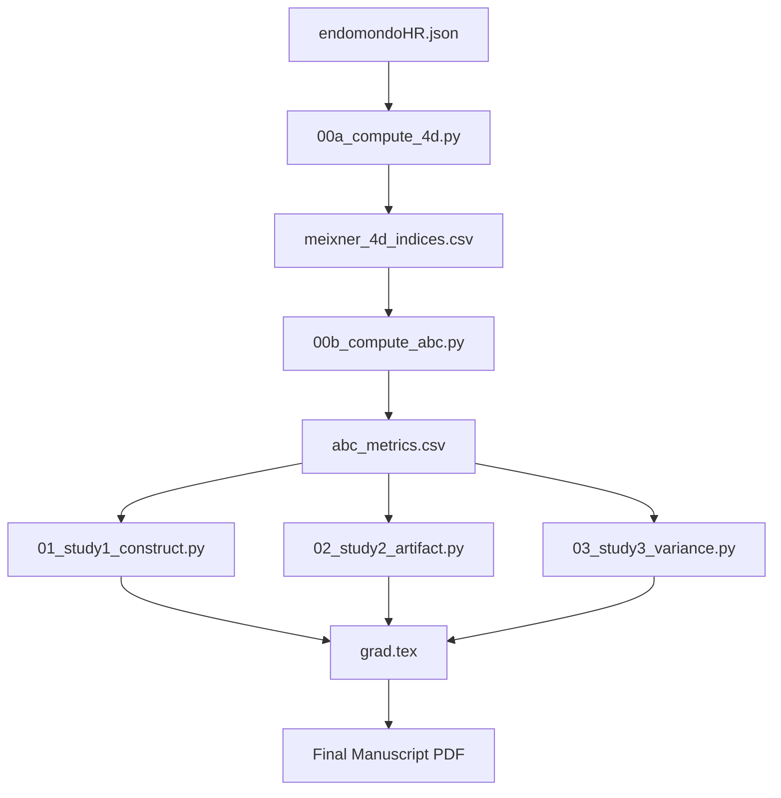

# GRAD: Gradient-Adjusted Cardiac Drift Analysis

[](https://www.python.org/downloads/)
[](https://opensource.org/licenses/MIT)

This repository contains the official implementation and reproducibility pipeline for the paper: **"Gradient-Adjusted Cardiac Drift: Isolating Durability from Route Geometry in Field-Based Endurance Telemetry."**

## 🔬 Overview

Heart Rate Drift (Cardiac Drift) is a key marker of endurance "Durability." However, in field settings, the raw Drift Index (DI = HR/Speed) is heavily confounded by route terrain (gradient). 

**GRAD** provides a regression-based framework to:
1.  **De-confound** heart rate telemetry from route geometry.
2.  **Extract** stable individual durability profiles (Gradient & Speed Sensitivity).
3.  **Provide** a multi-session aggregation protocol for reliable field monitoring.

### Key Findings
- **High Confounding**: Route features predict **80%** of raw DI variance ($R^2 = 0.80$).
- **Effective Correction**: GRAD-corrected metrics reduce route-predictability to near-zero ($R^2 \approx 0.02$).
- **Reliability**: Individual "Gradient Sensitivity" reaches adequate reliability ($\text{SB} \geq 0.80$) with just **5 sessions**.

---

## 🛠️ Pipeline Architecture



---

## 🚀 Quick Start

### 1. Requirements
- Python 3.10+
- `pip install pandas numpy scipy scikit-learn pyyaml matplotlib seaborn`

### 2. Configuration
All hyperparameters (filtering thresholds, bin boundaries, etc.) are centralized in `config.yaml`.
```yaml
filters:
  min_duration_min: 90
  min_altitude_range_m: 200
```

### 3. Run Pipeline
To reproduce all results and figures from the paper:
```bash
python run_all.py
```

---

## 📊 Methodology

### Gradient-Adjusted Cardiac Drift (GACD)
We model heart rate ($HR$) as a function of time, speed ($v$), and gradient ($g$):
$$HR = \beta_0 + \beta_{\text{time}} \cdot t + \beta_{\text{speed}} \cdot v + \beta_{\text{gradient}} \cdot g + \epsilon$$

The coefficient $\beta_{\text{time}}$ represents the **true durability signal**, isolated from terrain-induced fluctuations.

---

## 📄 Citation
If you use this code or our findings in your research, please cite:
```bibtex
@article{meixner2025grad,
  title={Gradient-Adjusted Cardiac Drift: Isolating Durability from Route Geometry in Field-Based Endurance Telemetry},
  author={...},
  journal={TBD},
  year={2025}
}
```
