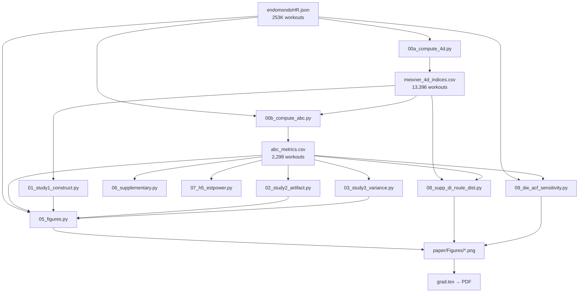

# GRAD: Gradient-Adjusted Cardiac Drift Analysis

[](https://www.python.org/downloads/)
[](https://opensource.org/licenses/MIT)

This repository contains the official implementation and reproducibility pipeline for the paper: **"Route Correction and Variance Decomposition for Aerobic Decoupling: A 13K-Workout Study of Durability Dimensionality."**

## 🔬 Overview

Heart Rate Drift (Cardiac Drift) is a key marker of endurance "Durability." However, in field settings, the raw Decoupling Index (DI = HR/Speed) is heavily confounded by route terrain (gradient).

**GRAD** provides a regression-based framework to:
1.  **De-confound** heart rate telemetry from route geometry.
2.  **Extract** stable individual durability profiles (Gradient & Speed Sensitivity).
3.  **Provide** a multi-session aggregation protocol for reliable field monitoring.

### Key Findings
- **High Confounding**: Route features predict **80%** of raw DI variance ($R^2 = 0.80$).
- **Effective Correction**: GACD-corrected metrics reduce route-predictability to near-zero ($R^2 \approx 0.02$).
- **Reliability**: Individual "Gradient Sensitivity" reaches adequate reliability ($\text{SB} \geq 0.80$) with just **5 sessions**.

---

## 🛠️ Pipeline Architecture



### Script Descriptions

| Script | Description | Input | Output |
|--------|------------|-------|--------|
| `00a_compute_4d.py` | Compute Meixner 4D indices (DI, FI, RI, ReI) | `endomondoHR.json` | `meixner_4d_indices.csv` |
| `00b_compute_abc.py` | Compute GACD regression + recovery metrics | `endomondoHR.json` | `abc_metrics.csv` |
| `01_study1_construct.py` | Study 1: Construct validity (PCA, ICC, correlations) | CSVs | `results/study1.txt` |
| `02_study2_artifact.py` | Study 2: Route-geometry artifact + simulation | CSVs | `results/study2.txt` |
| `03_study3_variance.py` | Study 3: Variance decomposition (Person/Route/Occasion) | CSVs | `results/study3.txt` |
| `04_verify.py` | Cross-check expected values against results | `results/*.txt` | — |
| `05_figures.py` | Generate publication figures (Figs 1–3) | `results/*.txt` | `paper/Figures/*.png` |
| `06_supplementary.py` | Extended descriptive statistics + FDR | CSVs | `results/supplementary.txt` |
| `07_h5_estpower.py` | Estimated-power experiment (Minetti cost) | `endomondoHR.json` | `results/h5_estimated_power.txt` |
| `08_supp_di_route_dist.py` | **Supp. Figure**: DI distribution by route type | CSVs | `paper/Figures/figS_di_route_distribution.png` |
| `09_dw_acf_sensitivity.py` | **Sensitivity**: Durbin-Watson + ACF analysis | `endomondoHR.json` | `paper/Figures/figS_dw.png`, `paper/Figures/figS_acf.png`, `results/sensitivity_autocorrelation.txt` |
| `10_sport_variance.py` | **Sport-specific**: ICC, SB, variance decomposition by sport | CSVs | `results/sport_variance.txt` |

---

## 🚀 Quick Start

### 1. Requirements
- Python 3.10+
- Dependencies:
  ```bash
  pip install -r requirements.txt
  ```

### 2. Data
Download the FitRec dataset from [Kaggle](https://www.kaggle.com/datasets/tientd95/fitrec-dataset) and place `endomondoHR.json` in `data/`.

### 3. Configuration
All hyperparameters (filtering thresholds, bin boundaries, etc.) are centralized in `config.yaml`.

### 4. Run Full Pipeline
To reproduce all results, figures, and sensitivity analyses:
```bash
# Option A: Python runner (recommended)
python run_all.py

# Option B: Shell script (includes data download)
bash run_all.sh

# Option C: Minimal reproduction
python reproduce_all.py
```

> **Note**: Scripts `00a`, `00b`, `07`, and `09` process the 6.5 GB JSON file and may take 10–20 minutes each. If intermediate CSVs already exist, preprocessing is skipped automatically.

### 5. Run Individual Scripts
```bash
# Fast (CSV-only, seconds)
python 01_study1_construct.py
python 08_supp_di_route_dist.py

# Slow (JSON processing, minutes)
python 09_dw_acf_sensitivity.py

# Fast (CSV-only, seconds)
python 10_sport_variance.py
```

---

## 📊 Methodology

### Gradient-Adjusted Cardiac Drift (GACD)
Heart rate ($HR$) is modelled as a function of time, speed ($v$), and gradient ($g$):

$$HR = \beta_0 + \beta_{\text{time}} \cdot t + \beta_{\text{speed}} \cdot v + \beta_{\text{gradient}} \cdot g + \epsilon$$

The coefficient $\beta_{\text{time}}$ captures the **within-session cardiac drift** after removing terrain confounds. The coefficients $\beta_{\text{gradient}}$ and $\beta_{\text{speed}}$ serve as **route-corrected fitness profiles**.

### Sensitivity Analysis (Script 09)
Temporal autocorrelation in point-level GPS data violates the OLS independence assumption. The sensitivity analysis quantifies this by computing:
- **Durbin-Watson statistics** for all sampled workouts
- **ACF plots** (lags 1–20) of GACD residuals
- **Newey-West HAC vs OLS standard error ratios** to assess SE inflation

---

## 📁 Directory Structure

```
GRAD/
├── data/
│   ├── endomondoHR.json          # Raw FitRec data (6.5 GB, not in repo)
│   ├── meixner_4d_indices.csv    # Generated by 00a
│   ├── abc_metrics.csv           # Generated by 00b
│   └── expected_values.json      # For verification (04)
├── results/                      # Text output from analyses
├── paper/
│   ├── Figures/                  # Generated figures
│   ├── grad.tex                  # Manuscript source
│   └── references.bib
├── 00a_compute_4d.py .. 10_sport_variance.py
├── run_all.py                    # Full pipeline runner
├── run_all.sh                    # Shell-based runner (with download)
├── reproduce_all.py              # Minimal reproduction runner
├── config.yaml                   # Hyperparameters
└── requirements.txt              # Python dependencies
```

---

## 📄 Citation
```bibtex
@article{ikari2025grad,
  title={Route Correction and Variance Decomposition for Aerobic Decoupling:
         A 13K-Workout Study of Durability Dimensionality},
  author={Ikari, Hisashi},
  journal={TBD},
  year={2025}
}
```
