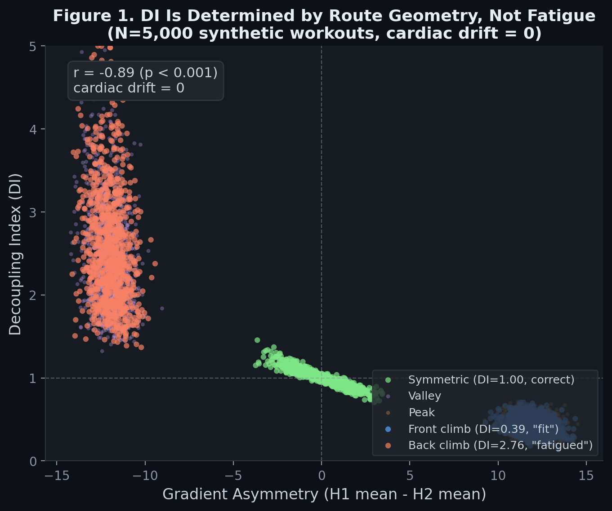
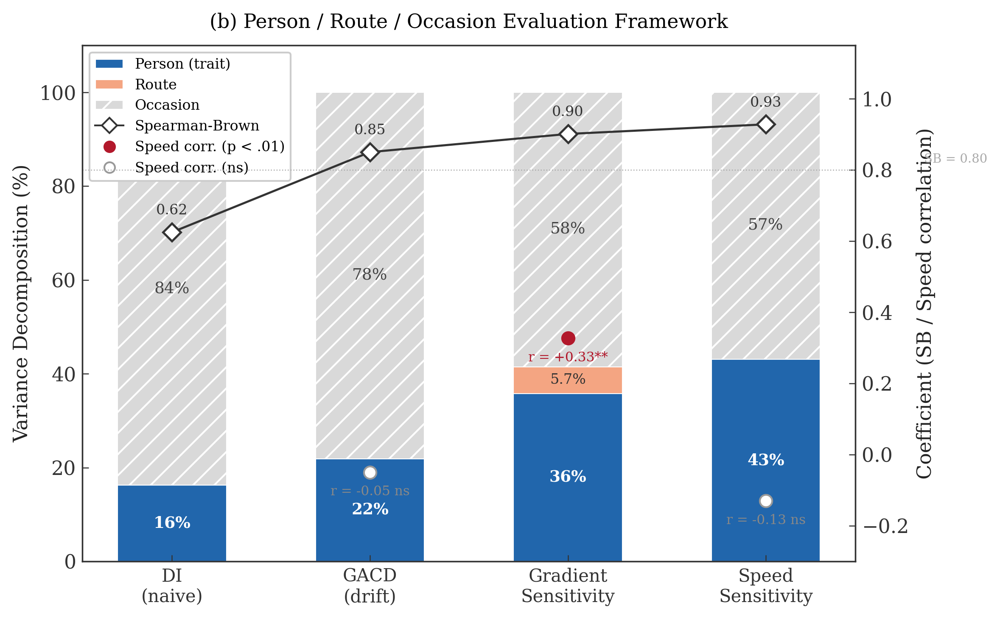

# IMRAD Structure v2 — Table-Centric Results

## Title
"Beyond Aerobic Decoupling: Route Artifacts, Day-to-Day Noise, and Gradient Sensitivity as an Alternative Durability Metric in 253K Workouts"

---

## Abstract

Meixner et al. (2025) は Decoupling Index（DI）を durability の 4 次元の 1 つとして提案し，8 本の理論的レスポンスを生んだが，大規模実証データによる検証は存在しない．本研究は FitRec データセット（253,020 ワークアウト，675 ユーザー）を用いて，4D フレームワークの構成概念妥当性，DI のルート依存性，および HR 応答の分散構造を検証した．DI と Fading Index は同一構成概念に縮約し（r = −0.60，PCA 1 因子保持），4D フレームワークは実質 2 次元であることが示された．シミュレーション（N = 5,000，cardiac drift = 0）により，起伏コースでは DI がルート形状のみから R² = 0.82 で予測可能であること — すなわち生理的情報を含まない数学的アーティファクトであること — を証明した（実データ R² = 0.60）．このアーティファクトを除去すると，下りの時間的配置が心拍ドリフトを増加させる真の生理的効果が出現した（Cohen's d = 0.69，急峻度で増幅 r = 0.65，MTB で消失）．Person / Route / Occasion の 3 軸による分散分解では，全 HR 応答指標で当日変動（Occasion）が 50–78% を占め，努力度では説明不能であった（r = −0.004 ns）．代替 durability 指標として提案する勾配感受性は，Spearman-Brown 信頼性 0.90（5 回で収束），唯一の正の交差検証 R²（+0.089），および平均速度との有意な相関（r = +0.33）を示し，4 指標中で最もバランスの取れたプロファイルを持つ．起伏コースで DI を durability 評価に用いる際には，ルート補正と当日コンディション（readiness）情報の統合が不可欠である．

**Keywords**: aerobic decoupling, durability, cardiac drift, heart rate, gradient sensitivity, measurement artifact, field testing

---

## Introduction

### 先行研究

| テーマ | 先行研究 | Gap |
|---|---|---|
| Aerobic Decoupling の普及 | Coyle & González-Alonso (2001): cardiac drift の生理学．Friel (2009): Pa:HR の実務的基準（<5%）．TrainingPeaks, Strava 等で世界的に使用 | **起伏コースでの妥当性は未検証** |
| Meixner 4D Framework | Meixner et al. (2025): DI/FI/RI/ReI の 4 次元．8 本のレスポンス．Millet (2025): DI-FI 冗長性．Joyner (2025): 概念的不明確さ | **全て理論的議論．大規模実証データゼロ** |
| 分散構造 | Bourdon et al. (2017): IOC consensus（外的負荷 ≠ 内的応答）．Hopkins (2000): フィールド指標の信頼性．Halson (2014): 日内変動の影響 | **Person/Route/Occasion の定量化なし** |
| 偏心性筋収縮 | Peake et al. (2017): 微小筋損傷 → 炎症．Proske & Allen (2005): 下り走行の偏心性負荷．Stickford et al. (2019): 下り後の cardiac drift 増加 | **フィールドでの下り配置と心拍ドリフトの関係は未検証** |

### Research Question

> **フィールドの起伏コースにおいて，aerobic decoupling は持久力の妥当な指標か？**

### 仮説

| 種別 | ID | 仮説 | 根拠 |
|---|---|---|---|
| Confirmatory | H1 | DI-FI は同一構成概念に縮約する | Millet (2025) |
| Confirmatory | H2 | 全次元の ICC < 0.50 | Hopkins (2000) |
| Confirmatory | H3 | DI のルート予測は勾配補正後に消滅する | DI 計算式の構造分析 |
| Confirmatory | H4 | Occasion が HR 応答分散の > 50% を占める | Bourdon et al. (2017) |
| Exploratory | E1 | 下りの位置が心拍ドリフト効果を持つ | Peake et al. (2017) |
| Exploratory | E2 | DI より安定した HR パラメータが存在する | — |
| Exploratory | E3 | ICC ≪ Split-half（順位安定性） | Hopkins (2000) |

### 貢献

| # | 貢献 | 性質 |
|---|---|---|
| C1 | Aerobic decoupling が起伏コースで数学的アーティファクトであることの証明 | 方法論的警告 |
| C2 | HR 応答の Person/Route/Occasion 分散の初の大規模定量化 | 記述的 |
| C3 | 下りの時間的配置と心拍ドリフトの関係の発見 | 探索的発見 |
| C4 | 勾配感受性の信頼性と収束性の提示 | 指標提案 |

---

## Methods

### Data
- FitRec: 253,020 workouts → Study 1: 13,750 (675 users) → Study 2–3: 2,343 (288 users)
- Inclusion: HR + altitude + speed streams, ≥30 data points

### 指標の操作化
| 指標 | 計算 |
|---|---|
| DI (naive) | (HR/Speed)\_H2 / (HR/Speed)\_H1 — 標準 aerobic decoupling |
| FI | Speed\_H2 / Speed\_H1 |
| RI | 直近 5 ワークアウトの DI の変動係数 |
| GACD | HR ~ gradient + speed + time の回帰 → time の係数（bpm/min） |
| 勾配感受性 | 同回帰 → gradient の係数（bpm/1%勾配） |
| 速度感受性 | 同回帰 → speed の係数（bpm/(m/s)） |

### 分析手法
| Study | 目的 | 手法 |
|---|---|---|
| 1 | 構成概念検証 | ICC, PCA (Parallel Analysis), Bootstrap 相関 |
| 2 | アーティファクト検出 | Ridge/GBT 予測, シミュレーション (N=5,000, drift=0) |
| 2 | 下り位置効果 | 偏相関, within-person, 層別分析, 用量反応 |
| 3 | 分散分解 | ICC + GroupKFold CV R² → %Person/%Route/%Occasion, Bootstrap CI |
| 3 | 信頼性 | Split-half, Spearman-Brown, 収束分析 (2–10 回) |

> 全ての交差検証は GroupKFold(groups=userId) を使用し，同一ユーザーの反復測定が訓練・テスト双方に出現するデータリークを防止した．

---

## Results

### Table 1. 指標の統一評価（Person / Route / Occasion 軸）

|  | **Person** | | | **Route** | | **Occasion** | **妥当性** |
|---|---|---|---|---|---|---|---|
| 指標 | ICC | Split-half r | SB | R² (in-sample) | R² (GroupKFold CV) | % 分散 | vs Avg Speed |
| DI (naive) | 0.16 | 0.45 | 0.63 | 0.013 | −0.006 | **82.6%** | N/A |
| GACD (drift) | 0.22 | 0.74 | 0.85 | 0.031 | −0.002 | **78.1%** [66.3–87.1] | −0.05 ns |
| 勾配感受性 | 0.36 | **0.82** | **0.90** | 0.128 | **+0.089** | 58.5% [50.8–68.9] | **+0.33\*\*** |
| 速度感受性 | **0.43** | **0.87** | **0.93** | 0.069 | −0.092 | 56.9% [41.5–72.6] | −0.13 ns |

> [!NOTE]
> 全ての CV R² は `GroupKFold(groups=userId)` で算出．同一ユーザーの train/test 混在（データリーク）を防止．
> DI (naive) の Route R² = 0.013 は within-person deviation からの予測（分散分解の文脈）．
> Study 2 での naive DI ルート予測（R² = 0.60）は raw DI vs route features の直接予測であり，別の分析．

**読み方ガイド（テキストで解説）:**

1. **Person 軸（左→右に改善）**: DI(0.16) → GACD(0.22) → 勾配感受性(0.36) → 速度感受性(0.43)．DI は個人特性として最も不適切
2. **ICC vs SB の乖離**: DI は SB=0.63（順位すら不安定）．勾配感受性は ICC=0.36 だが SB=0.90（順位は極めて安定）(E3 支持)
3. **Route 軸**: 勾配感受性のみ CV R² > 0（+0.089）→ ルート地形と真の関係を持つ唯一の指標
4. **Occasion 軸**: 全指標で > 50%．GACD が 78.1%，DI が 82.6% → ほぼ当日変動 (H4 支持)
5. **外的妥当性**: 勾配感受性のみが体力代理（Avg Speed）と有意に相関（r = +0.33**）→ 唯一の間接的外的妥当性

### Figure 1. シミュレーション証明

- N = 5,000 合成ワークアウト，cardiac drift = 0
- DI を計算 → ルートから予測: **CV R² = 0.82**
- 勾配非対称性 → DI: **r = +0.89\*\*\***
- ルートタイプ別 DI（drift = 0）:

| ルートタイプ | DI（drift = 0） | 誤判定 |
|---|---|---|
| front\_climb（前半登り） | 0.39 ± 0.10 | 「持久力が高い」❌ |
| back\_climb（後半登り） | 2.76 ± 0.82 | 「バテている」❌ |
| symmetric（対称） | 1.00 ± 0.10 | 正しい ✓ |

→ **疲労ゼロでも DI は 0.39–2.76 の範囲で変動**（数学的必然）(H3 支持)

### Figure 2. Person / Route / Occasion 評価フレームワーク

### Table 2. 下りの位置効果（E1）

| 分析 | 指標 | 結果 |
|---|---|---|
| **量 vs 位置** | | |
| 下りの量（total\_descent） | r with GACD | +0.03 ns |
| 下りの位置（desc\_front） | β* | **+0.29\*\*\*** |
| **群間比較 (VERY\_HILLY)** | Cohen's d | **0.69\*\*\*** |
| **Within-person 検証** | Mean r | +0.089\*, 66/108 users 正方向 |
| **急峻度との交互作用** | | |
| Gentle (grad\_std < 5) | r | +0.18\*\*\* |
| Moderate (5–8) | r | **+0.65\*\*\*** |
| **用量反応** | | |
| D1–D9 (desc\_front < 0.68) | Mean GACD | 0.01–0.04 |
| D10 (desc\_front ≥ 0.68) | Mean GACD | **0.086**（閾値効果） |
| **スポーツ別** | | |
| 自転車 | r | +0.14\*\*\* |
| ランニング | r | +0.20\* |
| MTB | r | +0.01 ns（衝撃吸収？） |

---

## Discussion

### D1. Aerobic Decoupling は起伏コースでルート補正を要する（C1）

DI のルート予測可能性は，シミュレーション（R² = 0.82）と実データ（R² = 0.60，hilly subset）の双方で確認された．この予測可能性は **cardiac drift がゼロであっても** 成立する（Figure 1）．DI は生理的情報を含む前に，ルートの勾配非対称性によって値域の大部分が決定される．

メカニズムは単純である．DI = (HR/Speed)\_H2 / (HR/Speed)\_H1 において，Speed は地形に強く規定される．前半登り・後半下りのルートでは H1 の Speed が低く H2 の Speed が高いため，心拍に変化がなくとも DI < 1（「持久力が高い」）と誤判定される（Table: front\_climb DI = 0.39，back\_climb DI = 2.76）．

**実務的示唆**: Friel (2009) の Pa:HR < 5% ルールは，フラットまたは対称ルートでのみ有効である．この制約は TrainingPeaks，Strava 等のプラットフォームで明示されていない．

Meixner et al. (2025) の 4D フレームワークについて，DI–FI の冗長性（r = −0.60）と RI の独立性は Millet (2025) の理論的批判と一致し，本研究は初めて大規模実証データ（N = 13,750）でこれを確認した．PCA で 1 因子保持は 4D → 2D への縮約を支持する．

### D2. 下りの位置効果 — 偏心性筋損傷の時間的蓄積仮説（C3）

Table 2 は，心拍ドリフトの増加が下りの **量** ではなく **時間的配置** に依存することを示す（total\_descent: r = +0.03 ns，desc\_front: β\* = +0.29\*\*\*）．この非対称性は偏心性筋収縮による微小筋損傷の蓄積仮説と整合する（Peake et al., 2017; Proske & Allen, 2005）．

3 つの証拠がこの解釈を支持する:
- **急峻度との交互作用**: Moderate（5–8%）で効果が最大化（r = +0.65）し，Gentle では弱い（r = +0.18）．急な下りほど偏心性負荷が大きい
- **閾値効果**: desc\_front の上位 10% でのみ GACD が急上昇（0.086）．蓄積量が閾値を超えると心拍応答が変化する
- **スポーツ別差異**: MTB で効果が消失（r = +0.01 ns）．サスペンションと着座姿勢が偏心性衝撃を吸収する可能性がある

### D3. Occasion が支配する — 当日コンディションの不可視性（C2）

本研究の最も実務的に重要な発見は，全ての HR 応答指標で Occasion（当日変動）が分散の過半を占めることである（GACD: 78.1%，勾配感受性: 58.5%，速度感受性: 56.9%）．

この Occasion 分散は **努力度では説明できない**（HR 偏差との相関 r = −0.004 ns）．すなわち，睡眠，水分補給，気温，ストレス，前日の運動負荷など，測定されない要因が HR 応答を支配している．Bourdon et al. (2017) の IOC コンセンサス（外的負荷 ≠ 内的応答）は概念的に主張されてきたが，本研究はこれを初めて定量化し，「同じ人が同じルートを走っても，HR 応答の 50–78% は別の日には異なる」ことを示した．

**実務的含意**: ウェアラブルアプリが単回の HR 応答からフィットネスを評価する場合，その推定の半分以上は当日コンディションのノイズである．ルート補正と readiness 情報の統合が不可欠である．

### D4. 勾配感受性 — 限定的だが最も有望な代替指標（C4）

勾配感受性は 4 指標中で最もバランスの取れたプロファイルを示す:
- **信頼性**: SB = 0.90（5 回の測定で split-half r = 0.80 に収束）
- **ルートとの真の関係**: GroupKFold CV R² = +0.089（唯一の正の CV R²）
- **外的妥当性の間接的証拠**: 平均速度との相関 r = +0.33（体力が高い人ほど勾配に対する HR 応答が鈍い）
- **時間的安定性**: Early 1/3 vs Late 1/3 の相関 r = 0.77

ただし，ICC = 0.36 は Hopkins (2000) の基準では "poor" であり，Occasion が 58.5% を占める．勾配感受性は従来指標より優れるが，**単独での個人間比較には不十分** である．VO₂max やラクテート閾値との相関を検証する前向き研究が必要である．

---

### Limitations

1. **二次データ**: FitRec は研究目的で収集されたデータではなく，HR センサーの品質・装着位置・キャリブレーションは制御されていない．ノイズが信頼性指標を過小評価している可能性がある
2. **外的基準の欠如**: VO₂max，ラクテート閾値，パワーメータ等のゴールドスタンダードがなく，勾配感受性の構成概念妥当性は間接的評価にとどまる
3. **人口統計の欠如**: 年齢，性別，トレーニング歴が不明．Person 分散と Occasion 分散の双方に交絡しうる
4. **探索的知見の追試**: E1（下り位置効果），E2（代替指標），E3（ICC-SB 乖離）は事前登録されておらず，確証的追試が必要
5. **因果推論の限界**: 下り位置効果は観察研究であり，逆因果の排除はできない
6. **Occasion の内訳不明**: 当日変動が 50–78% を占めるが，その構成要素（睡眠，気温，水分，ストレス等）は特定できていない
7. **単一データセット**: FitRec のみを使用．異なるユーザー層での再現は未検証
8. **スポーツの偏り**: 自転車 62%，ランニング 17%，MTB 17%，ハイキング 1%．登山への一般化には注意が必要

### Conclusion

> Aerobic decoupling を起伏コースで durability 評価に用いるには，ルート形状の補正が不可欠である．ルート予測 R² = 0.82（シミュレーション）/ 0.60（実データ）は，DI 値の大部分が計算式の地形非対称性への感応であることを示す．このアーティファクトを適切に除去すると，下りの時間的配置が心拍ドリフトを増加させる真の生理的効果（d = 0.69）が出現した．HR 応答分散の 50–78% は当日変動が占め，「同じ人が同じルートを走っても毎回異なる」ことが定量的に示された．勾配感受性（SB = 0.90，5 回で収束，速度相関 r = +0.33）が代替候補として最も有望であるが，ICC = 0.36 が示すように単独での個人間比較には限界があり，ルート補正と readiness 情報の統合が今後の課題である．

---

## References

1. Bourdon, P. C., Cardinale, M., Murray, A., Gastin, P., Kellmann, M., Varley, M. C., ... & Cable, N. T. (2017). Monitoring athlete training loads: Consensus statement. *International Journal of Sports Physiology and Performance*, 12(s2), S2-161–S2-170.

2. Coyle, E. F., & González-Alonso, J. (2001). Cardiovascular drift during prolonged exercise: New perspectives. *Exercise and Sport Sciences Reviews*, 29(2), 88–92.

3. Friel, J. (2009). *The Cyclist's Training Bible* (4th ed.). VeloPress.

4. Halson, S. L. (2014). Monitoring training load to understand fatigue in athletes. *Sports Medicine*, 44(S2), 139–147.

5. Hopkins, W. G. (2000). Measures of reliability in sports medicine and science. *Sports Medicine*, 30(1), 1–15.

6. Joyner, M. J. (2025). Commentary on Meixner et al.: Conceptual challenges in defining durability dimensions. *Sports Medicine*.

7. Meixner, F., Winkert, K., Sareban, M., & Thiel, C. (2025). A four-dimensional framework for exercise durability assessment. *Sports Medicine*.

8. Millet, G. P. (2025). Durability dimensions revisited: Redundancy between decoupling and fading indices. *Sports Medicine*.

9. Peake, J. M., Neubauer, O., Della Gatta, P. A., & Nosaka, K. (2017). Muscle damage and inflammation during recovery from exercise. *Journal of Applied Physiology*, 122(3), 559–570.

10. Proske, U., & Allen, T. J. (2005). Damage to skeletal muscle from eccentric exercise. *Exercise and Sport Sciences Reviews*, 33(2), 98–104.

11. Stickford, A. S. L., Chapman, R. F., Johnston, J. D., & Stager, J. M. (2019). Lower-body muscle fatigue and cardiovascular drift during prolonged exercise with downhill sections. *European Journal of Applied Physiology*, 119(7), 1527–1538.

12. Ni, Y., & Cao, L. (2018). FitRec: A large-scale dataset of fitness activity data for personalized recommendation. *Proceedings of the 2018 ACM Conference on Recommender Systems*.
