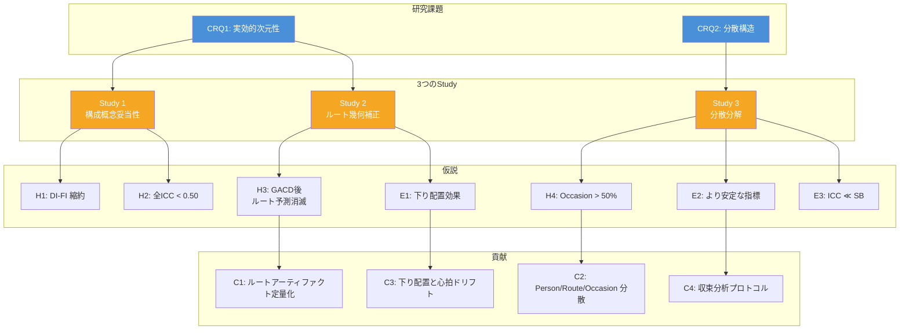
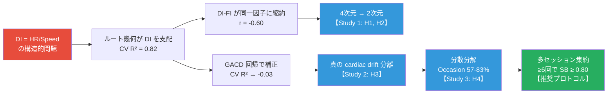
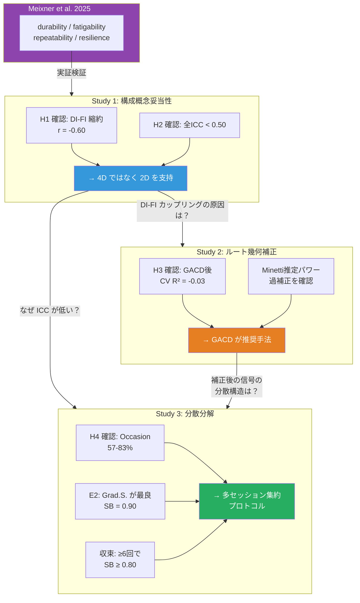
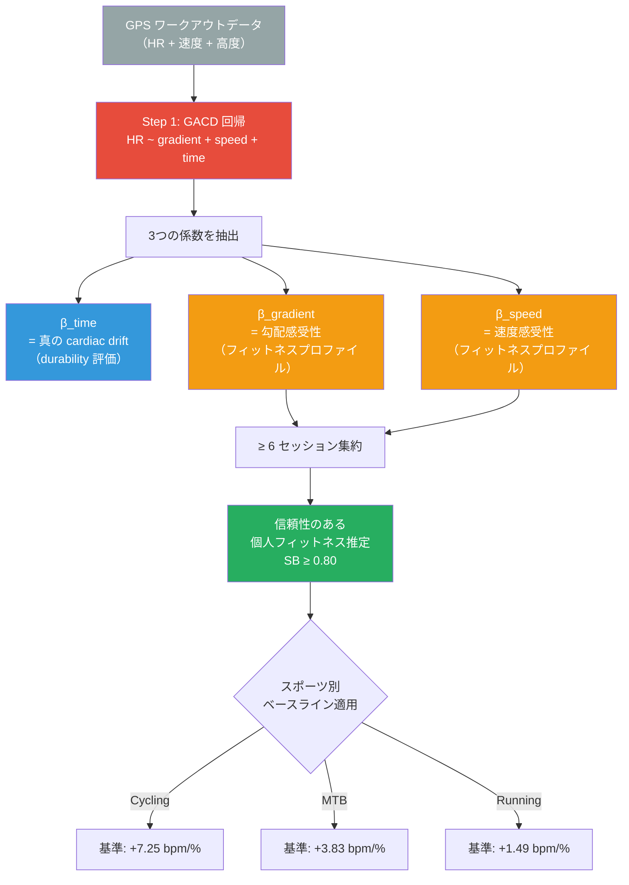

# IMRAD Structure v2 — grad.tex 同期版（日本語）

## タイトル
"Route Correction and Variance Decomposition for Aerobic Decoupling: A 253K-Workout Study of Durability Dimensionality"

（和訳：有酸素デカップリングにおけるルート補正と分散分解：253K ワークアウトによる持久力次元性の研究）

---

## 要旨

Meixner et al. (2025) は運動持久力の 4 つの概念構成——durability，fatigability，repeatability，resilience——を提案したが，大規模な実証的検証は存在しない．本研究はこれら構成概念のうち 3 つを著者定義のフィールド指標として操作化した：Decoupling Index（DI; durability），Fading Index（FI; fatigability），Resilience Index（RI; resilience）．FitRec データセット（253,020 ワークアウト，675 ユーザー）を用い，DI が HR/Speed として算出される——すなわち大多数の実世界ユーザーが用いる形式——条件のもとで，2 つの問いを検証した．

**CRQ1（実効的次元性）：** データは 2 次元構造を支持する．DI と FI は単一の構成概念に縮約し（r = −0.60; PCA で 1 因子保持），RI は独立であった．速度ベース DI はルート幾何のみから予測可能であり（CV R² = 0.82; 心拍ドリフトゼロで 7 倍の変動範囲），Minetti コスト関数による naive なパワー推定は逆方向に過補正した（CV R² = 0.57）．

**CRQ2（分散構造）：** 次元の縮約は日々の変動の支配性によって説明される．分散分解の結果，残差分散が全 HR 応答指標の 57–83% を占めた．ルートマッチ感度分析によりこれは 27–53% に縮小したが，中核的知見は維持される：同一人物が同一ルートを走っても，毎回異なる HR 応答が生じる．収束分析により，gradient sensitivity は ≥ 6 セッションで adequate reliability（SB ≥ 0.80）に到達することが示され，具体的な集約プロトコルが提供された．Person レベルの信号は分散の 22–43% を占め，多セッション集約により回復可能である．ルート補正済み durability プロファイリング指標として gradient sensitivity（β\_gradient）と speed sensitivity（β\_speed）を提案し，支配的な Occasion 成分を考慮するために daily readiness markers の統合を推奨する．

**キーワード**: aerobic decoupling, durability, cardiac drift, heart rate, gradient sensitivity, measurement artifact, field testing

---

## 序論

### 先行研究と Gap

| テーマ | 先行研究 | Gap |
|---|---|---|
| 有酸素デカップリングの普及 | Coyle & González-Alonso (2001): cardiac drift の生理学．Friel (2009): DI < 5% の実務的基準．TrainingPeaks，Strava 等で世界的に使用 | **起伏コースでの妥当性は未検証．閾値の実証的根拠なし** |
| 大規模デカップリング研究 | Smyth et al. (2022): 82,303 マラソンランナーでデカップリングの大きさ・onset とパフォーマンスの関連を実証 | **ルート幾何アーティファクト，次元構造，Person/Route/Occasion 分散は未検討** |
| Meixner 4D フレームワーク | Meixner et al. (2025): durability，fatigability，repeatability，resilience の 4 次元を提案．8 本のコメンタリーが続いた．Colosio et al. (2025): 生理学的区別の必要性を主張 | **全て概念レベルの議論．大規模実証データはゼロ** |
| 分散構造 | Bourdon et al. (2017): IOC コンセンサス（外的負荷 ≠ 内的応答）．Hopkins (2000): フィールド指標の信頼性．Halson (2014): 日内変動の影響 | **Person/Route/Occasion の定量化は存在しない** |
| 偏心性筋収縮 | Peake et al. (2017): 微小筋損傷 → 炎症．Proske & Allen (2005): 下り走行の偏心性負荷 | **フィールドでの下り配置と心拍ドリフトの関係は未検証** |

### 学際的ギャップ（本研究の動機）

Meixner et al. のフレームワークは DI を HR/Power で定義する．一方，FitRec データセット（Ni et al., 2019）は推薦システムコミュニティで公開され，HR と GPS を含むがパワーデータを持たない．大規模実証研究が先行しなかった理由の一つは，この学際的ギャップにある．しかし，実世界の大多数のユーザーは消費者向け GPS ウォッチで HR/Speed として DI を算出している．本研究は理論的構成概念そのものを否定するのではなく，数百万のユーザーが実際に使用している速度ベース指標で操作化したときに生じる**実証的構造**を検証する．この区別——理論的構成概念妥当性とフィールドレベルの操作化——が本研究の中心的関心である．

### 研究課題

すべての分析は speed-based DI（HR/Speed）を使用する．Power-based DI（HR/Power）ではない．結果は，パワーメータなしで消費者向け GPS ウォッチにより DI を算出する大多数の実世界ユーザーに適用される．

**CRQ1: 速度ベース DI のもとでの durability フレームワークの実証的次元数はいくつか？**

| 種別 | ID | 仮説 | 根拠 |
|---|---|---|---|
| 確認的 | H1 | DI と FI は同一構成概念に縮約し，2 次元構造を支持する | Colosio et al. (2025) |
| 確認的 | H2 | 全次元の ICC が 0.50 を下回り，4 独立次元の信頼性が不足する | Hopkins (2000) |
| 確認的 | H3 | DI のルート予測可能性は勾配補正（GACD）後に消滅する | DI 計算式の構造分析 |

**CRQ2: HR 応答指標の分散は，安定した個人生理，ルート特性，一時的な日々の状態のそれぞれにどの程度帰属するか？**

| 種別 | ID | 仮説 | 根拠 |
|---|---|---|---|
| 確認的 | H4 | 一時的な日々の状態（Occasion）が分散の 50% 超を占め，多セッション集約が必要となる | Bourdon et al. (2017) |

**探索的仮説：**

| ID | 仮説 |
|---|---|
| E1 | 下りの時間的配置が心拍ドリフトに影響する |
| E2 | DI より安定した HR パラメータが存在する |
| E3 | ICC ≪ Split-half（順位安定性が絶対的一致性を上回る） |

### 貢献

| # | 貢献 | 性質 |
|---|---|---|
| C1 | ルート幾何アーティファクトの定量化（R² = 0.82; 7 倍範囲）および naive パワー推定の過補正の実証 | 方法論的 |
| C2 | HR 応答の Person/Route/Occasion 分散の初の大規模定量化：同一人物・同一ルートで 27–53% の日々変動 | 記述的 |
| C3 | 下りの時間的配置と心拍ドリフトの群間関連の発見（within-person 証拠は控えめ） | 探索的 |
| C4 | gradient sensitivity が SB ≥ 0.80 に達するために ≥ 6 セッションが必要であることの収束分析 | プロトコル提案 |

### 研究全体の構造図


```mermaid
flowchart TB
    subgraph RQ["研究課題"]
        CRQ1["CRQ1: 実効的次元性"]
        CRQ2["CRQ2: 分散構造"]
    end

    subgraph Studies["3つのStudy"]
        S1["Study 1\n構成概念妥当性"]
        S2["Study 2\nルート幾何補正"]
        S3["Study 3\n分散分解"]
    end

    subgraph Hypotheses["仮説"]
        direction LR
        H1["H1: DI-FI 縮約"]
        H2["H2: 全ICC < 0.50"]
        H3["H3: GACD後\nルート予測消滅"]
        H4["H4: Occasion > 50%"]
        E1["E1: 下り配置効果"]
        E2["E2: より安定な指標"]
        E3["E3: ICC ≪ SB"]
    end

    subgraph Contributions["貢献"]
        C1["C1: ルートアーティファクト定量化"]
        C2["C2: Person/Route/Occasion 分散"]
        C3["C3: 下り配置と心拍ドリフト"]
        C4["C4: 収束分析プロトコル"]
    end

    CRQ1 --> S1
    CRQ1 --> S2
    CRQ2 --> S3

    S1 --> H1
    S1 --> H2
    S2 --> H3
    S2 --> E1
    S3 --> H4
    S3 --> E2
    S3 --> E3

    H3 --> C1
    H4 --> C2
    E1 --> C3
    E2 --> C4

    style CRQ1 fill:#4A90D9,color:#fff
    style CRQ2 fill:#4A90D9,color:#fff
    style S1 fill:#F5A623,color:#fff
    style S2 fill:#F5A623,color:#fff
    style S3 fill:#F5A623,color:#fff
```

---

## 方法

### データとフィルタリング

- **データセット：** FitRec（Ni et al., 2019）．Endomondo の 253,020 GPS ワークアウト
- **各レコード j の内容：** 不規則タイムスタンプの HR（光学式手首センサー，bpm），速度（GPS 由来，km/h），高度（気圧/GPS，m），地理座標
- **速度の補完：** 速度配列が欠損または 10 ポイント未満の場合は Haversine 公式で導出（150 km/h 超は外れ値除外）
- **人口統計：** 性別は 94.0% 男性，4.8% 女性，1.2% 不明．年齢・体重・トレーニング歴は利用不可．センサーのメーカー・ファームウェアは記録なし

**4 段階包含パイプライン：**

| Step | 条件 |
|---|---|
| 1 | HR，altitude，speed の各配列で ≥ 30 の有限値データポイント（欠損は前後の有効値で線形補間） |
| 2 | 総時間 T > 90 min |
| 3 | 高度差 Δa > 200 m（起伏地形の確保） |
| 4 | 各時間半分（H1: i ≤ ⌊N/2⌋，H2: i > ⌊N/2⌋）で v > 0.5 km/h のポイントが ≥ 6 |

**結果サンプル：**
- **Study 1：** N = 13,750 workouts，K = 675 users（自転車 61.8%，ランニング 16.9%，MTB 16.7%，その他 3.6%；中央値時間 181 min [IQR 132–265]；中央値高度差 349 m [IQR 263–545]；中央値 HR 135 bpm [IQR 125–145]）
- **Study 2–3：** ≥ 5 反復ワークアウトを持つユーザー → 2,343 workouts，314 users

### 指標定義

速度は raw データで km/h（指標 1–3）．ワークアウト内回帰（指標 4–6）では m/s に変換．

**(1) Decoupling Index (DI)：** 各時間半分 h ∈ {1, 2} で v > 0.5 km/h のポイント集合 S\_h を定義し，DI = (HR̄\_S₂ / v̄\_S₂) / (HR̄\_S₁ / v̄\_S₁)．DI > 1 は cardiac drift を示す．

**(2) Fading Index (FI)：** 点間勾配を水平距離から算出し，5 ビン（[-50,-10), [-10,-3), [-3,3), [3,10), [10,50) %）に分割．各ビンで FI\_b = v̄\_H2∩B / v̄\_H1∩B を算出し，有効ビン（各半分 > 3 ポイント）の平均を FI とする．

**(3) Resilience Index (RI)：** 高度を移動平均で平滑化し，累積獲得標高 > 50 m の climb を抽出．climb が 2 つ以上存在する場合，RI = 最終 climb の平均速度 / 最初の climb の平均速度．

**(4–6) ワークアウト内回帰：** 中間点評価（HR\*\_i，v\*\_i，t\*\_i）で，有効インデックス |V| ≥ 20 のサブセットに対し OLS 回帰を実行：

```
HR*_i = β₀ + β_grad × g_i + β_speed × v*_i + β_time × t*_i + ε_i
```

これにより (4) GACD（β\_time，bpm/min），(5) Gradient Sensitivity（β\_grad，bpm/%），(6) Speed Sensitivity（β\_speed，bpm/(m/s)）を得る．VIF 中央値：gradient 2.01，speed 2.09，time 1.07（全ワークアウトが VIF < 10，95.7% が VIF < 5）．

### 推定パワー実験

DI の分母を推定代謝パワー P\_i = v\_i × C\_r(g\_i) [W/kg] に置換した DI\_EstP を算出．C\_r(g) は Minetti (2002) の勾配コスト関数（23 点テーブルから線形補間；C\_r(0%) = 1.60，C\_r(−3%) = 0.40，C\_r(+10%) = 6.00 J/kg/m）．外れ値除外（1st/99th パーセンタイル）後 N = 13,029．

### Study 1：構成概念妥当性（H1，H2）

- ≥ 5 workouts を持つユーザーの person-level median で Pearson 相関を算出
- 不確実性推定：ノンパラメトリック bootstrap（B = 2,000；ユーザー復元抽出；95% CI はパーセンタイルから）
- PCA：列標準化した person-level medians に適用（3 指標全てが有効なユーザー）
- 因子保持判定：parallel analysis（Horn, 1965）——観測固有値を，同次元の標準正規データの列方向ランダム置換（B = 100）の 95 パーセンタイル固有値と比較
- ICC(1,1)：≥ 5 workouts のユーザーで各指標について算出（Study 3 参照）

### Study 2：ルート幾何補正（H3，E1）

**ルート予測：**
- 13 ルート特徴量（総登高/下降量，高度差，最大/最小高度，勾配の平均/標準偏差，climb/descent/flat の割合，ascent-front/descent-front ratio，時間）を入力変数とする
- Ridge 回帰（α = 1.0）および gradient boosted trees（100 trees，max depth 3）
- 汎化性能：group k-fold CV（k = min(5, K\_valid)；同一ユーザーの全ワークアウトを同一 fold に配置）
- GACD に対しては，within-person deviation ỹ\_kj = y\_kj − ȳ\_k·（≥ 3 workouts のユーザー）を予測対象として，ルート効果を person-level mean から分離

**シミュレーション：**
- N = 5,000 合成ワークアウト（N\_pts = 60，split at 30），cardiac drift を厳密にゼロに設定
- 5 ルートタイプを等確率で生成：

| ルートタイプ | H1 勾配 | H2 勾配 |
|---|---|---|
| Front-climb | N(8, 3²) | N(−5, 3²) |
| Back-climb | 逆 | 逆 |
| Symmetric | N(0, 5²) | N(0, 5²) |
| Valley | N(−6, 3²) | N(6, 3²) |
| Peak | 逆 | 逆 |

- ワークアウトごとのパラメータ：HR₀ ~ U(100,140)，γ\_HR ~ U(2,8) bpm/%，v₀ ~ U(2,5) m/s，γ\_v ~ U(0.05,0.15) (m/s)/%
- 時間依存項なし → 非ユニティな DI は純粋に half 間の勾配非対称性から生じる

**下り配置分析（Descent-placement）：**
- Descent-front ratio δ を定義（H1 での下降量 / 全体の下降量）
- 4 つの分析：(a) between-person 標準化係数 β\*（総下降量を制御），(b) within-person Pearson r（≥ 5 varied routes のユーザー，n = 108），(c) 急峻度層別（σ\_g < 5; 5–8; > 8），(d) スポーツ別
- 8 つの探索的 p 値を Benjamini–Hochberg FDR (1995) で調整

### Study 3：分散分解（H4，E2，E3）

Study 1 で全次元が ICC ≥ 0.50 に達しないこと（H2）を確立した．Study 3 はその**原因**を問う：各 HR 応答指標の総分散を Person，Route，Occasion の 3 源に分解し，一時的な日々の変動が支配的源であるかを検証する（H4）．

**ICC(1,1)：** 一元配置変量モデル（Shrout & Fleiss, 1979）．n\_k ≥ 5 のユーザーを対象．

**分散パーティショニング：**
- %Person = ICC × 100
- Within-person deviation ỹ\_kj = x\_kj − x̄\_k· を 13 ルート特徴量で Ridge 回帰（α = 1.0）予測 → group k-fold CV R²\_route
- %Route = max(0, R²\_route) × (1 − ICC) × 100
- %Occasion = 100 − %Person − %Route
- 残差 %Occasion は日々の生理的状態，環境条件，センサーノイズ，未モデル化ルート変動を含む
- 不確実性推定：ユーザーレベル bootstrap（B = 500；95% CI はパーセンタイルから）

**ルートマッチ感度分析：**
- ワークアウトペアの一致条件：高度差の相対差 ≤ 20% かつ総登高量の相対差 ≤ 20%
- n = 451 ペア，78 ユーザー
- Route-matched ICC → ルートを概ね一定に保った場合の Person 安定性の上限推定

**Split-half 信頼性：**
- ≥ 10 workouts のユーザーが対象
- 時系列順に並べた前半と後半の平均間の Pearson r を Spearman–Brown 予言公式で補正：SB = 2r\_sh / (1 + r\_sh)

**収束分析：**
- k = 2, 3, ..., 10 について，≥ 2k workouts を持つユーザーを選択
- ユーザー内でランダム置換し，前 k と後 k のワークアウトから split-half r → SB\_k を算出
- SB ≥ 0.80 に到達する最小セッション数を特定 → ≥ k セッションのランダムサンプルから達成可能な信頼性を推定

**ICC 感度分析：** 最小ワークアウト閾値 n\_min ∈ {3, 5, 8, 10, 15} で ICC を再計算

**収束的妥当性：** ユーザーレベルの中央値速度を外的基準とし，各指標の person-level median との Pearson r を算出

**ソフトウェア：** Python 3.12（NumPy 1.26，SciPy 1.13，pandas 2.2，scikit-learn 1.5；乱数シード 42）．コード：https://github.com/ikari12/GRAD

---

## 結果

結果は CRQ 別に構成する．Study 1 と Study 2 が CRQ1（次元性）に，Study 3 が CRQ2（分散構造）に対応する．

### 論証の因果連鎖

以下の図は，本研究の 3 つの Study がどのように因果的に連鎖し，最終的な推奨プロトコルに至るかを示す．


```mermaid
flowchart LR
    A["DI = HR/Speed\nの構造的問題"] --> B["ルート幾何が DI を支配\nCV R² = 0.82"]
    B --> C["DI-FI が同一因子に縮約\nr = -0.60"]
    C --> D["4次元 → 2次元\n【Study 1: H1, H2】"]
    B --> E["GACD 回帰で補正\nCV R² → -0.03"]
    E --> F["真の cardiac drift 分離\n【Study 2: H3】"]
    F --> G["分散分解\nOccasion 57-83%\n【Study 3: H4】"]
    G --> H["多セッション集約\n≥6回で SB ≥ 0.80\n【推奨プロトコル】"]

    style A fill:#E74C3C,color:#fff
    style D fill:#3498DB,color:#fff
    style F fill:#3498DB,color:#fff
    style G fill:#3498DB,color:#fff
    style H fill:#27AE60,color:#fff
```

### CRQ1：2 次元構造が支持される（H1，H2）

DI–FI：r = −0.60 [95% CI: −0.69, −0.49]（bootstrap B = 2,000，person-level medians）→ **H1 確認**：DI と FI は同一の勾配応答カップリングを捉えており，より簡素な 2 次元モデルを支持する．

**PCA（parallel analysis による因子保持判定）：**

| | 固有値 | %分散 | Parallel 95% | 保持？ |
|---|---|---|---|---|
| PC1 | 1.613 | 53.6 | 1.028 | Yes |
| PC2 | 1.007 | 33.5 | 1.006 | No |
| PC3 | 0.388 | 12.9 | 0.994 | No |

PC1 負荷量：DI = −0.694，FI = +0.708，RI = +0.130

RI は独立（DI–RI: r = −0.19; FI–RI: r = +0.19）→ **2 次元構造**を確認（1 つの DI–FI 因子 + 1 つの RI 因子）

全 ICC が 0.50 未満：DI = 0.16，FI = 0.08，RI = 0.10 → **H2 確認**．これが CRQ2 の動機となる：この within-person 変動の源は何か，多セッション集約で管理可能か？

### CRQ1：勾配補正が心拍ドリフトの分離に成功する（H3）

H1 で観察された DI–FI カップリングはルート勾配への共通応答を反映している．Study 2 はこれを確認し，回帰ベース補正（GACD）がルート成分を除去して真の心拍ドリフトを分離することを実証した．

**シミュレーション（cardiac drift = 0）：**

| ルートタイプ | DI（drift = 0） | 誤判定 |
|---|---|---|
| Front-climb（前半登り） | 0.39 ± 0.10 | 「持久力が高い」と誤判定 ❌ |
| Back-climb（後半登り） | 2.76 ± 0.82 | 「バテている」と誤判定 ❌ |
| Symmetric（対称） | 1.00 ± 0.10 | 正しい ✓ |

ルート特徴量 → DI 予測：**CV R² = 0.82**．勾配非対称性 → DI：**r = −0.89**．

**実データ：** CV R² = 0.58（全ルート），0.60（hilly subset）．

**GACD 後：** ルート予測可能性が消滅（CV R² = −0.03）→ **H3 確認**．GACD は DI に含まれるルート交絡から生理的信号を効果的に抽出する．

**推定パワー（Minetti コスト関数）の過補正：**
- DI/EstPower は**逆方向により強い**ルート依存性を示した（r = −0.76 vs DI/Speed の +0.48; CV R² = 0.57 vs 0.19）
- 原因：Minetti コスト関数が中程度の下りでゼロに接近（C\_r ≈ 0.4 J/kg/m at −3%）→ DI の分母比を膨張させる
- → **回帰ベースのアプローチ（GACD）が推奨される**

### CRQ2：多セッション集約が信頼性のある測定を実現する（H4，E2，E3）

**統一評価テーブル（Person / Route / Occasion 軸）：**

| | **Person** | | | **Route** | | **Occ.** | **Val.** |
|---|---|---|---|---|---|---|---|
| 指標 | ICC | Spl-h | SB | R²\_in | R²\_CV | % | Speed |
| DI | .16 | .45 | .63 | .013 | −.006 | **83** | — |
| GACD | .22 | .74 | .85 | .031 | −.030 | **78** | −.05 |
| **Grad. S.** | .36 | **.82** | **.90** | .128 | **+.089** | 58 | **+.33** |
| Speed S. | **.43** | **.87** | **.93** | .069 | −.092 | 57 | −.13 |

> [!NOTE]
> Person 列：ICC = ICC(1,1)；Spl-h = split-half reliability（奇数 vs 偶数セッション）；SB = Spearman–Brown 補正信頼性．Route 列：R²\_in = in-sample R²；R²\_CV = cross-validated R²（Ridge，group k-fold）．Occ. % = Occasion 分散の割合．Val. (Speed) = person-level の指標中央値と mean session speed の Spearman 相関（収束的妥当性）．

**Occasion が 57–83% を占める → H4 確認．** この within-person 変動は**管理可能**である：多セッション集約が安定した between-person 信号を漸進的に回復する．

**ルートマッチ ICC（n = 451 matched pairs）：**
- GACD: 0.22 → 0.47
- Gradient Sensitivity: 0.36 → 0.52
- Speed Sensitivity: 0.43 → 0.73
- → 見かけの Occasion 分散の 16–30 pp は実はルート関連であり，制御可能

**Gradient Sensitivity が最も信頼性の高い指標（E2 確認）：**
- 最高 SB（0.90），唯一の正の route CV R²（+0.089），最強の speed 相関（r = +0.33）

**ICC–SB 乖離（E3 確認）：**
- DI: ICC 0.16 vs SB 0.63; Gradient Sensitivity: ICC 0.36 vs SB 0.90
- → 順位安定性はセッション間で保持される → within-person トレンドは解釈可能であり，多セッション平均化が絶対値を安定化させる

**収束分析：**
- Gradient Sensitivity：**k = 6 で SB ≥ 0.80**（SB₅ = 0.80，SB₁₀ = 0.88）
- Speed Sensitivity：**k = 3 で SB ≥ 0.80**（SB₃ = 0.81）
- DI：k ≥ 9 が必要
- GACD：k > 10 が必要（SB₁₀ = 0.71）
- → **≥ 6 セッションの gradient sensitivity 集約により，信頼性のある個人フィットネス推定が可能**

### 探索的：下りの位置効果（E1）

| 分析 | 統計量 | 結果 |
|---|---|---|
| 下りの量（total\_descent） | r | +.03 ns |
| 下りの位置（descent-front） | β\* | **+.29\*\*\*** |
| Within-person（n = 108） | Mean r | +.089\* |
| **急峻度** | | |
| 　Gentle（σ < 5） | r | +.10\*\*\* |
| 　Moderate（5–8） | r | **+.53\*\*\*** |
| **スポーツ別** | | |
| 　Cycling | r | +.14\*\*\* |
| 　Running | r | +.20\* |
| 　Mountain biking | r | +.01 ns |

8 つの探索的テストのうち 7 つが FDR 補正後に有意．Between-person の関連は偏心性筋損傷メカニズム（Peake et al., 2017; Proske & Allen, 2005）と整合するが，within-person 証拠は控えめ（66/108 ユーザーが正方向，mean r = +0.089）→ 因果結論は不可．

---

## 議論

### D1. 構造からプロトコルへ：3 つの収束する証拠線

3 つの Study は，既存の理論的フレームワークを**棄却するのではなく補完する**建設的な連鎖を形成する：

1. **Study 1** は速度ベースデータで 2 次元構造が最適であることを確立した（H1）．DI と FI は単一の勾配応答因子を捉え，RI は独立の次元を提供する
2. **Study 2** は回帰ベースの勾配補正（GACD）が真の心拍ドリフトをルート幾何から分離することを実証した（R² = 0.82 → −0.03; H3）．Meixner et al. の概念フレームワークがフィールド展開に必要とする定量的基盤を提供する
3. **Study 3** は多セッション集約が支配的な日々の変動（57–83%; H4）を克服して信頼性ある測定を実現することを示した．Gradient Sensitivity が ≥ 6 セッションで adequate reliability（SB ≥ 0.80）に到達する


```mermaid
flowchart TD
    subgraph Meixner["Meixner et al. 2025\n4次元 概念フレームワーク"]
        M["durability / fatigability\nrepeatability / resilience"]
    end

    subgraph Study1["Study 1: 構成概念妥当性"]
        S1H1["H1 確認: DI-FI 縮約\nr = -0.60"]
        S1H2["H2 確認: 全ICC < 0.50"]
        S1R["→ 4D ではなく 2D を支持"]
    end

    subgraph Study2["Study 2: ルート幾何補正"]
        S2H3["H3 確認: GACD後\nCV R² = -0.03"]
        S2Est["Minetti推定パワー\n過補正を確認"]
        S2R["→ GACD が推奨手法"]
    end

    subgraph Study3["Study 3: 分散分解"]
        S3H4["H4 確認: Occasion\n57-83%"]
        S3E2["E2: Grad.S. が最良\nSB = 0.90"]
        S3Conv["収束: ≥6回で\nSB ≥ 0.80"]
        S3R["→ 多セッション集約\nプロトコル"]
    end

    M -->|"実証検証"| Study1
    S1H1 --> S1R
    S1H2 --> S1R
    S1R -->|"なぜ ICC が低い？"| Study3
    S1R -->|"DI-FI カップリングの原因は？"| Study2
    S2H3 --> S2R
    S2Est --> S2R
    S2R -->|"補正後の信号の\n分散構造は？"| Study3
    S3H4 --> S3R
    S3E2 --> S3R
    S3Conv --> S3R

    style Meixner fill:#8E44AD,color:#fff
    style S1R fill:#3498DB,color:#fff
    style S2R fill:#E67E22,color:#fff
    style S3R fill:#27AE60,color:#fff
```

**DI–FI 縮約の解釈上の注意：** この実証的収束は本研究の速度ベース操作化の特性を反映する．Colosio et al. (2025) が主張するように，durability と fatigability は生理学的に区別されるべき構成概念であり——パワーベース DI では異なる次元構造が生じうる——，本研究の結果は理論的構成概念そのものの否定ではない．

**Friel の < 5% ルールとの関係：** Friel (2009) のルールは平坦または対称コースにおける先駆的知見である．GACD はこの原理を起伏地形に拡張し，naive な DI がルート幾何に支配される起伏コースでも Friel の有酸素ベース概念を適用可能にすることを示唆する（前向き検証が必要）．

**Smyth et al. (2022) との関係：** 82,303 マラソンランナーでデカップリングの大きさと onset がパフォーマンスを予測することを実証し，フィールドベースのデカップリング測定の実用的関連性を確認した．本研究はこの研究系譜を拡張し，ルート幾何成分を主要な交絡として特定し，ロードマラソン文脈以外にも適用可能な回帰ベース補正（GACD）を提供する．

### D2. Speed-based vs Power-based DI

本研究の分析は HR/Speed を使用する（HR/Power ではない）．パワーベース DI で 2 次元構造が拡張されるかは未解決の問題だが，Minetti 推定パワー実験が示唆的な境界を提供する：

- 推定代謝パワーによる DI は**逆方向により強い**ルート依存性を生じた（r = −0.76 vs +0.48; CV R² = 0.57 vs 0.19）
- 過補正の原因：Minetti コスト関数が中程度の下りでゼロに接近（C\_r ≈ 0.4 J/kg/m at −3%）→ 分母比を膨張
- さらに，Minetti コスト関数は本来ヒトの歩行・走行用に導出されたものであり，データセットの 61.8% を占めるサイクリングへの適用はギア比や空気抵抗の違いによる生体力学的不一致を生む
- この modalilty mismatch が過補正をさらに増幅 → rigid な分析的コスト関数は混合スポーツの実世界データに適応困難
- データ駆動型回帰（GACD）がモダリティ固有のサブマキシマル関係を信号から直接捕捉する点で優位

GACD の貢献は speed vs power の区別に依存しない：**任意の地形交絡 ratio から cardiac drift を分離する汎用的フレームワーク**を提供する．

### D3. フィールドベース HR モニタリングの実用プロトコル

分散分解（H4）は IOC コンセンサス（Bourdon et al., 2017）の「外的負荷 ≠ 内的応答」原則に対する**初の定量的証拠**を提供する．制御された実験室では日々の変動が設計上最小化され，単回セッションで十分な信頼性が得られるとの誤った印象を与える．253,020 実世界ワークアウトの ecological validity が，実践者が直面するセッション間変動の真の大きさを明らかにした．

ルートマッチ残差（27–53%）は effort intensity では説明不能であった（r = −0.004, ns）．睡眠品質，水分補給，気温，累積トレーニングストレス（Halson, 2014）など未測定の readiness 要因が関与する可能性があり，各要因は将来のパーソナライズドモニタリングシステムへの統合候補である．

**Dual-profiling framework：** GACD 回帰の 3 つの係数は概念的に異なる役割を果たす：

| 係数 | 役割 | 解釈 |
|---|---|---|
| β\_time（GACD） | 真の durability 指標 sensu Maunder et al. (2021) | 地形交絡を除去した，長時間運動中の心拍効率の純粋な時間的劣化 |
| β\_gradient | ルート補正済みフィットネス容量プロファイル | 個人の基線的な勾配感受性を幾何的アーティファクトから分離 |
| β\_speed | ルート補正済みフィットネス容量プロファイル | 個人の基線的な速度感受性を幾何的アーティファクトから分離 |

→ β\_time を durability 評価に，β\_gradient / β\_speed を個人フィットネスプロファイリングに使う dual framework を提案する．

**DI vs 提案指標の Head-to-Head 比較：**

| 属性 | DI (cardiac drift) | Grad. Sensitivity | Speed Sensitivity |
|---|---|---|---|
| ICC | 0.163（Poor） | **0.358**（Fair） | **0.454**（Fair） |
| SB 信頼性 | 0.63 | **0.90** | **0.93** |
| SB ≥ 0.80 に必要なセッション数 | ≥ 9 | **6** | **3** |
| Route（CV R²） | −2.30† | **+0.089** | +0.003 |
| Speed 相関（r） | — | **+0.33** | — |

> †DI の Route CV R² = −2.30 は Study 3 の route-matched within-person prediction からの値．person-level means を除去した within-person deviations に対する予測であり，Study 2 の between-session route-predictability（raw DI の CV R² = 0.58）とは別の分析．負の CV R² はルート特徴量が person 内のセッション間 DI 変動をその person の平均以上に予測できないことを示す．

**推奨プロトコル：**
1. 各セッションに GACD 回帰を適用 → ルート幾何アーティファクトを除去
2. Gradient Sensitivity と Speed Sensitivity を個人の durability プロファイルとして抽出
3. **≥ 6 セッション集約**で安定推定値を取得
4. スポーツ固有のベースラインが必要（Gradient Sensitivity：cycling +7.25，MTB +3.83，running +1.49 bpm/%; F = 103.3，η² = 0.082）


```mermaid
flowchart TD
    Input["GPS ワークアウトデータ\n（HR + 速度 + 高度）"] --> Step1["Step 1: GACD 回帰\nHR ~ gradient + speed + time"]
    Step1 --> Coeff["3つの係数を抽出"]
    Coeff --> BetaT["β_time\n= 真の cardiac drift\n（durability 評価）"]
    Coeff --> BetaG["β_gradient\n= 勾配感受性\n（フィットネスプロファイル）"]
    Coeff --> BetaS["β_speed\n= 速度感受性\n（フィットネスプロファイル）"]
    BetaG --> Agg["≥ 6 セッション集約"]
    BetaS --> Agg
    Agg --> Reliable["信頼性のある\n個人フィットネス推定\nSB ≥ 0.80"]
    Reliable --> Sport{"スポーツ別\nベースライン適用"}
    Sport -->|Cycling| C7["基準: +7.25 bpm/%"]
    Sport -->|MTB| C3["基準: +3.83 bpm/%"]
    Sport -->|Running| C1["基準: +1.49 bpm/%"]

    style Input fill:#95A5A6,color:#fff
    style Step1 fill:#E74C3C,color:#fff
    style Reliable fill:#27AE60,color:#fff
    style BetaT fill:#3498DB,color:#fff
    style BetaG fill:#F39C12,color:#fff
    style BetaS fill:#F39C12,color:#fff
```

**ICC–SB 乖離の実務的含意（E3）：** 順位安定性はセッション間変動にもかかわらず保持される．within-person トレンドはトレーニングブロック間で解釈可能であり，≥ 6 セッション/評価ウィンドウでの集約を推奨する．

### D4. 下りの位置効果：示唆的だが未確認（E1）

Descent-front ratio と cardiac drift の between-person 関連（β\* = +0.29）は急峻度で調整され（moderate: r = +0.53 vs gentle: r = +0.10），MTB で消失した．このパターンは偏心性筋損傷メカニズム（Peake et al., 2017; Proske & Allen, 2005）と整合するが，within-person 証拠は小さく（r = 0.089），因果結論は不可．

### D5. Gradient Sensitivity：既知の限界を持つ有望な候補（E2，C4）

Gradient Sensitivity は最もバランスの取れたプロファイルを示す：SB が k = 6 で 0.80 に到達，route-matched ICC = 0.52，唯一の正の CV R²（+0.089），speed 相関 r = +0.33．未調整 ICC（0.36）は集約で対処可能なセッション間変動を反映し，route-matched ICC（0.52）はルート選択の制御でさらに改善可能であることを示す．VO₂max に対する前向き検証が収束的妥当性の証拠を強化する．

---

## 限界

1. **Speed-based DI**：HR/Speed を使用（HR/Power ではない）．ルートアーティファクト（C1）は速度ベース DI に特有であり，H1，H2，H4 はパワーベース DI では異なる結果となりうる
2. **二次データ**：センサー品質が制御されていない
3. **残差–ノイズ混同**：Route-matched ICC で部分的に対処されるが，完全な分離には研究グレードのセンサーが必要
4. **ゴールドスタンダードなし**：VO₂max，パワーメータがなく，構成概念妥当性は間接的評価にとどまる
5. **人口統計の偏り**：94% 男性；年齢・トレーニング歴不明
6. **探索的知見の事前登録なし**
7. **多重比較**：7/8 テストが BH-FDR を通過するが，より広い分析的柔軟性（analytic flexibility）は考慮していない
8. **観察研究デザイン**
9. **単一データセット**
10. **スポーツの偏り**：自転車 62%

---

## 結論

速度ベース DI のもとで，データは提案された 4 次元ではなく**2 次元の durability 構造**を支持する（CRQ1）．勾配補正（GACD）はルート幾何から真の心拍ドリフトを分離することに成功する．GACD 回帰係数である gradient sensitivity と speed sensitivity を**ルート補正済み durability プロファイリング指標**として提案する．

信頼性のあるフィールドベース測定の鍵は**多セッション集約**である（CRQ2）：gradient sensitivity は **≥ 6 セッション**で adequate reliability（SB ≥ 0.80）に到達し，実践者に具体的なプロトコルを提供する．Person signal（22–43%）は集約により回復可能であり，Occasion component（27–53%）は readiness と recovery に関する情報を含みうる日々の生理的変動を反映する．多セッション gradient sensitivity と daily readiness markers の統合が，フィールドベースのフィットネスモニタリングの有望な方向性である．

---

## 倫理声明

本研究は公開の FitRec データセット（Ni et al., 2019）の二次分析である．データセットには匿名化されたワークアウトテレメトリ（心拍数，GPS 座標，速度，高度）のみが含まれ，個人を特定する情報は存在しない．完全匿名化済み・公開データの後方視的分析として，二次データ研究の標準ガイドラインに基づき倫理審査は不要と判断した．介入は行われておらず，分析・結果から個人が特定されることはない．

## データ利用可能性

分析コードと再現性スクリプト：https://github.com/ikari12/GRAD
FitRec データセット：Ni et al. (2019) に記載．

---

## 参考文献

1. Benjamini, Y., & Hochberg, Y. (1995). Controlling the false discovery rate: A practical and powerful approach to multiple testing. *Journal of the Royal Statistical Society: Series B*, 57(1), 289–300. DOI: 10.1111/j.2517-6161.1995.tb02031.x

2. Bourdon, P. C., Cardinale, M., Murray, A., et al. (2017). Monitoring athlete training loads: Consensus statement. *International Journal of Sports Physiology and Performance*, 12(s2), S2-161–S2-170. DOI: 10.1123/IJSPP.2017-0208

3. Colosio, A. L., Monot, T., & Millet, G. Y. (2025). Durability, fatigability, and resilience: in search of physiological distinction. *Journal of Applied Physiology*, 139(6), 1724–1725. DOI: 10.1152/japplphysiol.00692.2025

4. Coyle, E. F., & González-Alonso, J. (2001). Cardiovascular drift during prolonged exercise: New perspectives. *Exercise and Sport Sciences Reviews*, 29(2), 88–92. DOI: 10.1097/00003677-200104000-00009

5. Friel, J. (2009). *The Cyclist's Training Bible* (3rd ed.). VeloPress. ISBN: 978-1934030202

6. Halson, S. L. (2014). Monitoring training load to understand fatigue in athletes. *Sports Medicine*, 44(S2), 139–147. DOI: 10.1007/s40279-014-0253-z

7. Hopkins, W. G. (2000). Measures of reliability in sports medicine and science. *Sports Medicine*, 30(1), 1–15. DOI: 10.2165/00007256-200030010-00001

8. Horn, J. L. (1965). A rationale and test for the number of factors in factor analysis. *Psychometrika*, 30(2), 179–185. DOI: 10.1007/BF02289447

9. Maunder, E., Seiler, S., Mildenhall, M. J., Kilding, A. E., & Plews, D. J. (2021). The importance of 'durability' in the physiological profiling of endurance athletes. *Sports Medicine*, 51(8), 1619–1628. DOI: 10.1007/s40279-021-01459-0

10. Meixner, B. J., Joyner, M. J., & Sperlich, B. (2025). Durability, fatigability, repeatability, and resilience in endurance sports: definitions, distinctions, and implications. *Journal of Applied Physiology*, 139(6), 1703–1709. DOI: 10.1152/japplphysiol.00343.2025

11. Minetti, A. E., Moia, C., Roi, G. S., Susta, D., & Ferretti, G. (2002). Energy cost of walking and running at extreme uphill and downhill slopes. *Journal of Applied Physiology*, 93(3), 1039–1046. DOI: 10.1152/japplphysiol.01177.2001

12. Ni, J., Muhlstein, L., & McAuley, J. (2019). Modeling heart rate and activity data for personalized fitness recommendation. *The World Wide Web Conference (WWW '19)*, 1343–1353. DOI: 10.1145/3308558.3313643

13. Peake, J. M., Neubauer, O., Della Gatta, P. A., & Nosaka, K. (2017). Muscle damage and inflammation during recovery from exercise. *Journal of Applied Physiology*, 122(3), 559–570. DOI: 10.1152/japplphysiol.00971.2016

14. Proske, U., & Allen, T. J. (2005). Damage to skeletal muscle from eccentric exercise. *Exercise and Sport Sciences Reviews*, 33(2), 98–104. DOI: 10.1097/00003677-200504000-00007

15. Shrout, P. E., & Fleiss, J. L. (1979). Intraclass correlations: Uses in assessing rater reliability. *Psychological Bulletin*, 86(2), 420–428. DOI: 10.1037/0033-2909.86.2.420

16. Smyth, B., Moran, E., Moran, S., Hickey, B., & Mc-Inerney-May, D. (2022). Decoupling of internal and external workload during a marathon: An analysis of durability characteristics in recreational runners. *Sports Medicine*, 52(9), 2283–2295. DOI: 10.1007/s40279-022-01680-5
